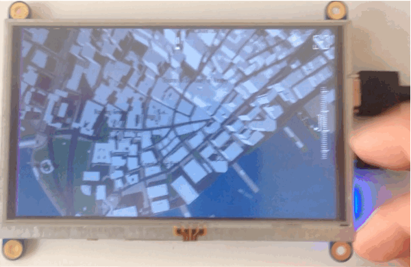
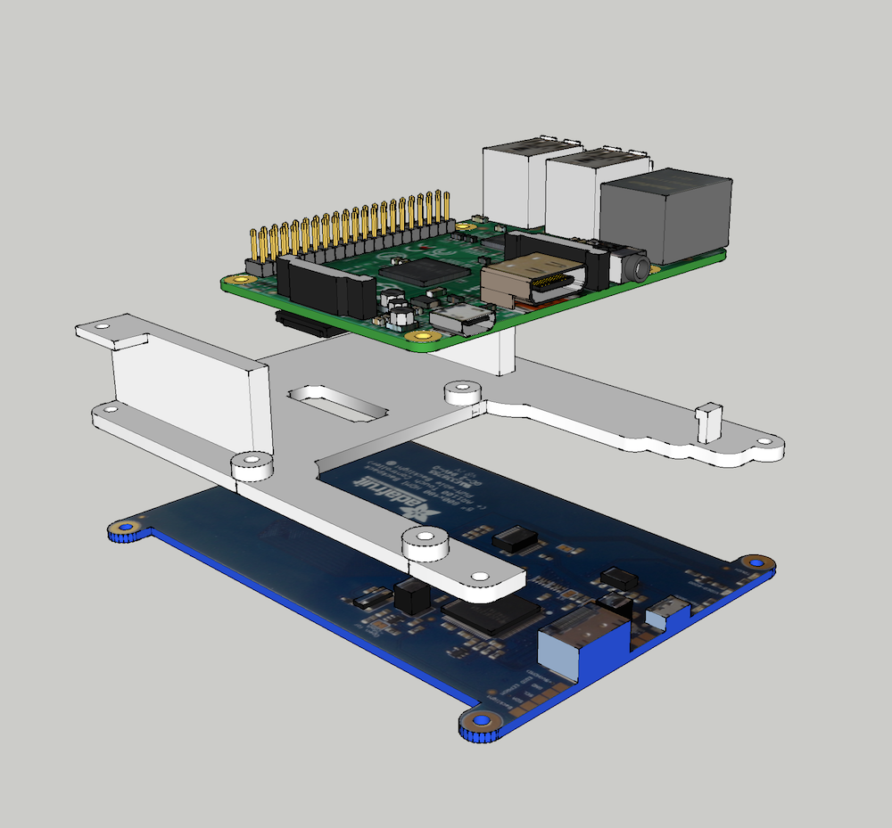
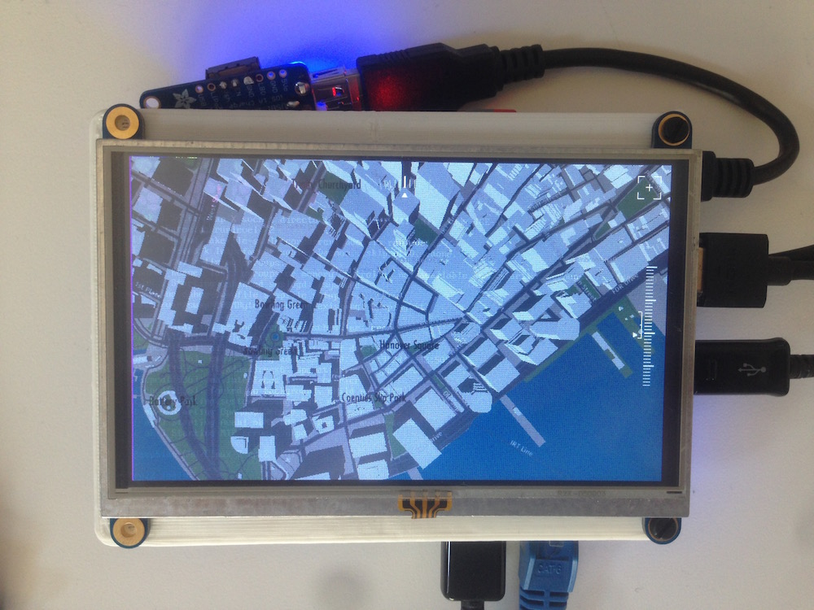
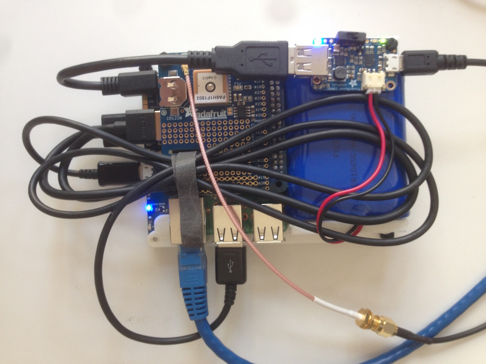

# Make your own GPS device with Tangram-es and RaspberryPi

A couple of month ago the nice folks of RaspberryPi publish a [blog post](https://www.raspberrypi.org/tangram-an-open-source-map-rendering-library/) about [Tangram-ES](https://github.com/tangrams/tangram-es) our Native 2D/3D Maps Render Engine running on their hardware. The feedback was great and people seams to be very excited of start using it for their own projects.

Tangram-ES is a WIP map engine in C++ and openGL ES 2.0, so could be a little intimidatory to start from scratch. That's way we thought in this small weekend project to put the ball running and ignites some ideas on the community.

In [this github repository](https://github.com/tangrams/PI-GPS) you will find:

- A 3D model to mount together a: RaspberryPi A+/B+, [Adafruit’s touch HDMI 5’’800x480 ](https://www.adafruit.com/product/2260), [Ultimate GPS Raspberry PI HAT](https://www.adafruit.com/products/2324), [Lithium Ion Batter](https://www.adafruit.com/products/353) and [PowerBoost 1000 Charger](https://www.adafruit.com/products/2465).

- A source code to run Tangram-es with a nice little graphic interface to move around, rotate and zoom with a touch only screen.

- An explanation on how you can modify ```tangram.cpp``` of Tangram-ES to load tiles locally.

## Hardware

Beside your RaspberryPi I’m using the following components to make a stand alone device:

- [HDMI 5’’800x480 Touch Screen](https://www.adafruit.com/product/2260)

- [Ultimate GPS Raspberry PI HAT](https://www.adafruit.com/products/2324)

- [Lithium Ion Batter](https://www.adafruit.com/products/353) 

- [PowerBoost 1000 Charger](https://www.adafruit.com/products/2465)

Which are hold together with the 3D-printed mounting station located on the file: ```parts/rpi-screen-mount.stl```.



Once you put everything together should look something like this:




## Compile and install Tangram-ES with a nice UI for RaspberryPi

Now let’s jump to the code aspect of this project.

First we need to clone this repository in your raspberryPi and install some dependences to compile everything.

```bash
sudo apt-get update
sudo apt-get install cmake libcurl4-openssl-dev g++-4.8
cd ~
git clone https://github.com/tangrams/PI-GPS.git
cd PI-GPS
git submodule update --init --recursive
mkdir build
```

Then, and just to make sure this is working, compile tangram and then run it.

```bash
export CXX=/usr/bin/g++-4.8
cd build                                                                       cmake ..
cd bin
tangram -m
```

*Note:* that we are running tangram with the ```-m``` flag to display the mouse

## Modify Tangram-ES to fetch tiles locally

Getting fast internet access directly to your RaspberryPi could be a problem, specially if you are planning to use this GPS devices in your bicycle. Let’s see what you need to do to download the map tiles locally so you don’t need an internet access to use Tangram-Es.

We install Tangram-ES and tested it in the previous section. Now is time for us to make some changes that will make Tangram-ES search for local files instead of fetching them from a server.

With this changes tangram will search for tiles inside the ```tiles/``` directory.

For that open ```~/PI-GPS/tangram-es/core/src/tangram.cpp``` in you favorite text editor.

```bash
cd ~/PI-GPS/tangram-es
vim core/src/tangram.cpp
```

Then add at top of the file this includes…

```cpp
#include <string>
#include <unistd.h>
```

… and at the ```void initialize()``` function where the ```TileManager``` is set, replace the text to make it look like this:

```cpp
// Create a tileManager
…

if (!m_tileManager) {
    m_tileManager = TileManager::GetInstance();

    // Pass references to the view and scene into the tile manager
    m_tileManager->setView(m_view);
    m_tileManager->setScene(m_scene);

    // Fetch Json local files
    char result[ FILENAME_MAX ];
    getcwd(result, FILENAME_MAX);
    std::unique_ptr<DataSource> dataSource(new GeoJsonSource());
    dataSource->setUrlTemplate("file://"+std::string(result)+"/tiles/[z]-[x]-[y].json");

    m_tileManager->addDataSource(std::move(dataSource));
}

…
```

Save, exit and recompile to apply this changes.

```bash
cd ~/PI-GPS/
export CXX=/usr/bin/g++-4.8
make
```

## Get the tiles of a town/city/region from OpenStreetMap 

My colige and friend [Peter Richardson](https://twitter.com/meetar) made this useful set of python script for downloading tiles locally at this repo call [Landgrab](https://github.com/tangrams/landgrab). 

Let’s start by downloading some dependences for this script.

```
sudo apt-get update
sudo apt-get install wget python-pip
sudo pip install requests
```

Then download Peter’s script in the directory where tangram was compile

```bash
cd ~/PI-GPS/build/bin
wget https://raw.githubusercontent.com/tangrams/landgrab/master/landgrab.py
```

Now is time to download the tiles of a place, for that we need the [OpenStreetMap](http://www.openstreetmap.org/) ID of the place we want to download. For that go to [OpenStreetMap Website](http://www.openstreetmap.org/) search for something and check for it ID (the number between brackets).

For example:

* Buenos Aires (1224652)
* London (65606)
* Manhattan (3954665)
* New YorkCity (175905)
* Paris (7444)
* Rio de Janeiro (2697338)
* Rome (41485)
* Sydney (13766899)
* Tokyo (4479121)
* Tucson (253824)

**Note**: If you choose another city that is not Manhattan you have to change it on the ```tangram.cpp``` to load initially load the map in that specific location where is said around line 44:

```cpp
// Move the view to coordinates in Manhattan so we have something interesting to test
glm::dvec2 target = m_view->getMapProjection().LonLatToMeters(glm::dvec2(-74.00796, 40.70361));
```

Once we choose a place that match the position tangram will start fetching tiles is time to grab all the tiles that we will need. For that we will use the python script we download with given OSM ID and the zoom level we are interested (in our case all of them from 1 to 18 ).

```bash
python landgrab.py 3954665 1-18
```

This will take a while 

## Finally run and enjoy!

Well done! Everything is ready to unplug your internet source and run tangram! 

```bash
cd ~/PI-GPS/build/bin
./tangram -m
```

I hope you are excited to about all the possibilities of having cool 3D maps on your projects. Seen us your opinions, feedback or photos of your projects!